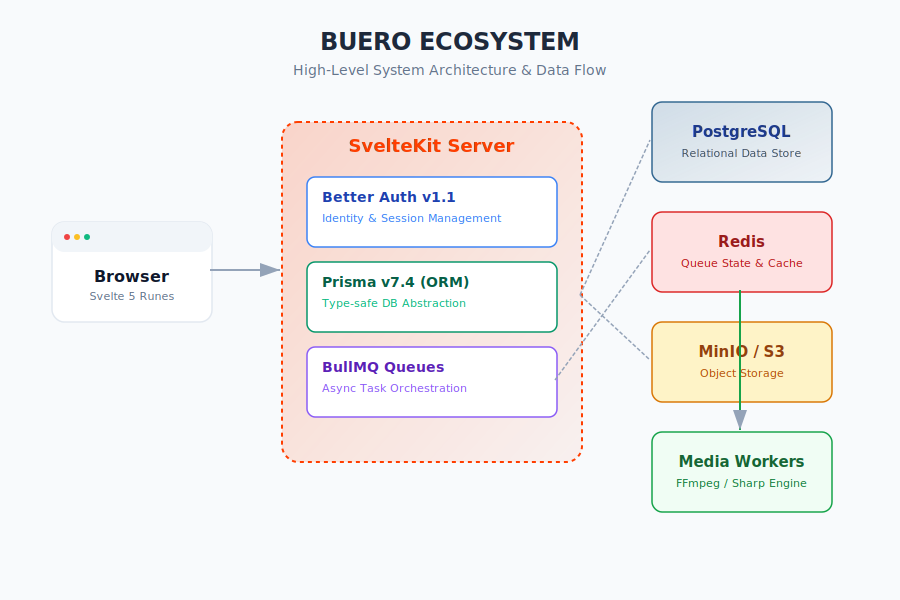

# Arquitetura do Sistema - Buero

Este documento detalha a arquitetura de alto nível do projeto Buero, focando na integração entre o frontend, backend e serviços de infraestrutura.

## 1. Camada de Frontend (Client)
- **Tecnologia:** Svelte 5 (Runes).
- **Responsabilidade:** Renderização reativa, gerenciamento de estado local via `$state` e `$derived`, e interatividade da interface do usuário.
- **Comunicação:** Utiliza Form Actions e chamadas de API (fetch) para interagir com o servidor SvelteKit.

## 2. Camada de Aplicação (SvelteKit Server)
O servidor atua como o orquestrador central:
- **Better Auth v1.1:** Gerencia o ciclo de vida da autenticação, sessões e segurança.
- **Prisma v7.4:** Camada de abstração do banco de dados (ORM), garantindo tipagem forte entre o banco e o código TypeScript.
- **BullMQ:** Gerencia filas de mensagens utilizando Redis como backend, permitindo que tarefas pesadas (como processamento de vídeo) sejam executadas de forma assíncrona.

## 3. Infraestrutura de Dados e Armazenamento
- **PostgreSQL:** Fonte da verdade para dados estruturados (usuários, posts, comentários, sessões).
- **MinIO / S3:** Armazenamento de objetos para arquivos de mídia originais e processados.
- **Redis:** Backend de alta performance para gerenciamento de estado das filas do BullMQ e cache (se aplicável).

## 4. Camada de Processamento (Workers)
- **Media Workers:** Processos isolados que escutam as filas do BullMQ para realizar:
  - Redimensionamento e otimização de imagens (via **Sharp**).
  - Transcodificação e geração de miniaturas de vídeo (via **FFmpeg**).
  - Atualização dos metadados no PostgreSQL via Prisma após a conclusão do processamento.
