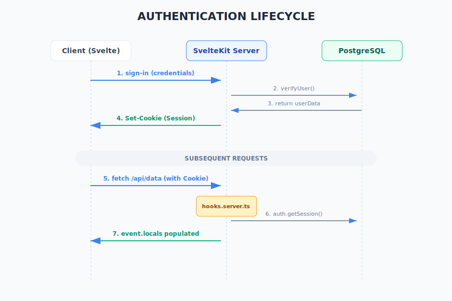

# Fluxo de Autenticação - Better Auth

O projeto utiliza o **Better Auth v1.1** para gerenciar a identidade dos usuários de forma segura e moderna.

## 1. Processo de Login
1. O cliente envia as credenciais para o endpoint gerenciado pelo Better Auth (`/api/auth/...`).
2. O servidor valida as credenciais contra o banco de dados PostgreSQL.
3. Se bem-sucedido, o Better Auth gera uma sessão e retorna um `Set-Cookie` com o token da sessão.

## 2. Validação de Sessão (Middleware)
O arquivo `src/hooks.server.ts` atua como um middleware global para todas as requisições:
- Ele intercepta a requisição e verifica a presença do cookie de sessão.
- Utiliza a função `auth.getSession(request)` para validar o token no banco de dados.
- Se a sessão for válida, os objetos `user` e `session` são injetados em `event.locals`, ficando disponíveis em todas as funções `load` e `actions` do servidor.

## 3. Segurança e Proteção de Rotas
- **Server Side:** A proteção é feita verificando `locals.user` nas rotas protegidas.
- **Client Side:** O `auth-client.ts` fornece hooks para verificar o estado da sessão de forma reativa no Svelte.
- **CSRF:** O Better Auth inclui proteções integradas contra ataques Cross-Site Request Forgery.

## 4. Esquema de Banco de Dados
O Better Auth gerencia automaticamente (via Prisma) as tabelas:
- `User`: Dados básicos do usuário.
- `Session`: Tokens de sessão ativos e expiração.
- `Account`: Vinculação com provedores externos (OAuth), se habilitado.
- `Verification`: Tokens para verificação de e-mail ou troca de senha.
