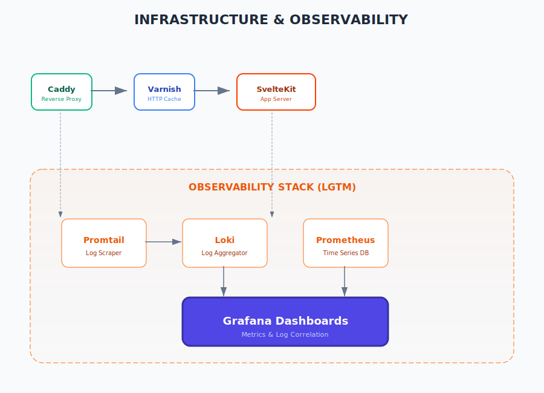

# Infraestrutura e Observabilidade

O projeto Buero é desenhado para alta performance e visibilidade operacional, utilizando uma stack moderna de proxy, cache e monitoramento.

## 1. Camada de Borda (Edge)
- **Caddy:** Atua como servidor web de entrada, gerenciando automaticamente certificados SSL (HTTPS) e servindo como proxy reverso para a aplicação e o cache. Sua configuração é declarativa via `Caddyfile`.

## 2. Aceleração HTTP e Cache
- **Varnish Cache:** Posicionado entre o Caddy e a aplicação SvelteKit, o Varnish armazena em memória as respostas de requisições GET. Isso reduz drasticamente a carga no servidor Node.js e acelera a entrega de conteúdo estático e páginas públicas.

## 3. Stack de Observabilidade (LGTM)
A stack de monitoramento permite rastrear a saúde do sistema em tempo real:
- **Logging (Loki + Promtail):** Os logs da aplicação (gerados pelo **Pino**) e do Caddy são coletados pelo Promtail, armazenados no Loki e podem ser consultados via Grafana. Isso inclui o `requestId` para rastreamento de requisições ponta a ponta.
- **Métricas (Prometheus):** Coleta dados de performance da aplicação (CPU, Memória, tempo de resposta, tamanho das filas do BullMQ).
- **Visualização (Grafana):** Dashboard central onde métricas e logs são correlacionados para análise técnica e depuração.

## 4. Gerenciamento de Logs Estruturados
Cada requisição no backend recebe um identificador único via `hooks.server.ts`. Esse ID é propagado para todos os logs gerados durante aquela operação, facilitando a identificação de erros em fluxos complexos.
