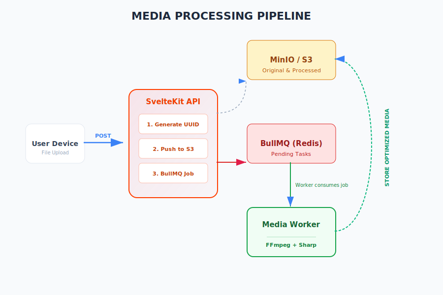

# Pipeline de Processamento de Mídia

O Buero utiliza um sistema robusto e assíncrono para lidar com uploads de arquivos, garantindo que a interface do usuário permaneça responsiva enquanto tarefas pesadas ocorrem em background.

## 1. Fase de Ingestão (Upload)
- O usuário submete um arquivo via formulário (`multipart/form-data`).
- O servidor SvelteKit recebe o arquivo, gera um identificador único (UUID) e faz o upload imediato do arquivo original para o **MinIO / S3**.
- Um registro inicial do post é criado no PostgreSQL com o status "pendente" ou apenas com a URL original.

## 2. Gerenciamento de Filas (BullMQ)
- Após o upload do original, o SvelteKit cria um "Job" na fila do **BullMQ**.
- O estado dessa fila é persistido no **Redis**, garantindo que nenhum trabalho seja perdido em caso de reinicialização do servidor.

## 3. Processamento Assíncrono (Workers)
Os workers são processos Node.js independentes especializados em processamento de mídia:
- **Imagens:** Utilizam a biblioteca **Sharp** para redimensionamento, compressão e geração de miniaturas.
- **Vídeos:** Utilizam **FFmpeg** para transcodificação em formatos otimizados para web (como MP4/WebM) e captura de frames para miniaturas.

## 4. Finalização e Entrega
- Uma vez processada, a mídia otimizada é enviada de volta para um bucket de "produção" ou "cache" no MinIO.
- O Worker atualiza o registro no banco de dados (via Prisma) com as novas URLs (mídia processada e miniatura).
- O sistema de cache (Varnish/CDN) passa a servir a versão otimizada para os usuários finais.
